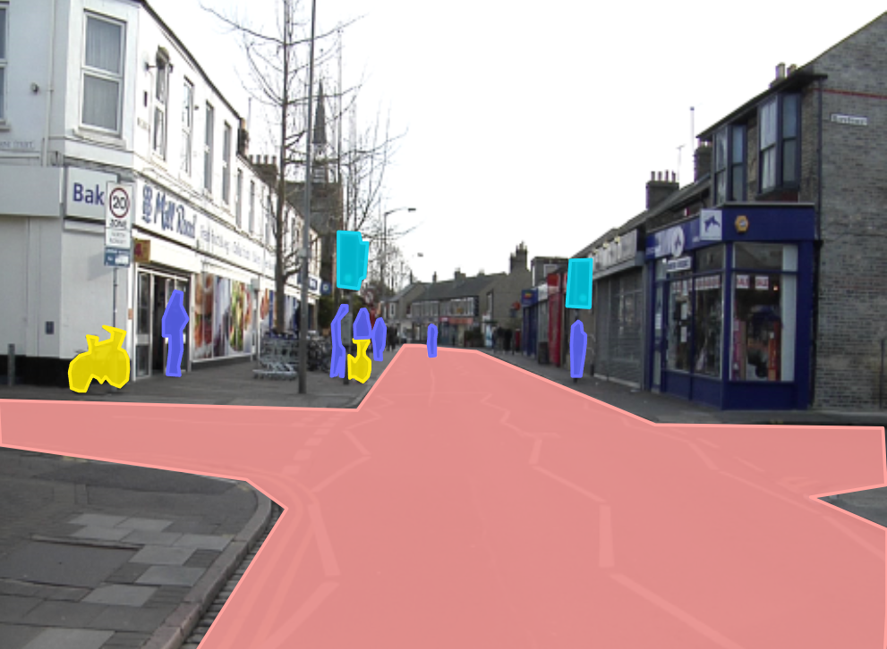

# Autonomous Vehicle Image Annotation Project  
*Image Labeling for AI Computer Vision Training — powered by Label Studio*

## Project Description

This project is a practical demonstration of how image data for autonomous vehicles is annotated using a professional labeling tool, [Label Studio](https://labelstud.io/). The goal is to simulate real-world annotation pipelines used in the development of computer vision models for self-driving cars.

This repository contains:
- Labeled sample images for vehicles, pedestrians, bicycle, and traffic signs
- Annotations exported in **COCO format**
- A clean and structured project setup ready to integrate with deep learning pipelines

## Why This Project is Useful

> **Why is annotation important for self-driving cars?**  
To train AI to "see" the road, we need high-quality labeled data. Every car, pedestrian, and sign the model encounters must be precisely marked. This dataset enables:

- Training and evaluating object detection models (YOLO, Faster R-CNN, etc.)
- Building proof-of-concept for real-time autonomous navigation systems
- Supporting data annotation tasks in AI/ML projects
- Showcasing capability in handling annotation workflows for clients and employers

This kind of project reflects the **backbone of supervised machine learning in computer vision**, and is highly valuable for any company working on smart mobility, traffic analytics, or automotive AI.

##  Real-World Applications

-  Object detection and tracking for autonomous driving
-  Road hazard analysis and safety systems
-  Smart city traffic management
-  Dataset preparation for AI model prototyping

##  Tools & Technologies

| Tool          | Purpose                      |
|---------------|-------------------------------|
| **Label Studio** | Annotation interface & project control |
| **COCO Format**  | Industry-standard annotation format   |
| **Python**       | Used for image downloading scripts    |
| **GitHub**       | Sharing, versioning, and showcasing   |

##  Why Use Polygon Annotation?

**Polygon annotations** offer a more precise way to mark objects by allowing to draw multiple connected points around their exact shapes. This is particularly useful in complex, real-world environments like urban streets where object boundaries are not always rectangular.

##  Advantages:
-  **Higher Accuracy**: Captures the true contour of irregular objects (e.g., people walking, cars at an angle).
-  **Better for Instance Segmentation**: Essential for training models that go beyond detection (e.g., Mask R-CNN).
-  **Rich Spatial Information**: Useful for depth estimation and fine-grained analysis in computer vision.

##  Disadvantages:
-  **More Time-Consuming**: Requires placing multiple points per object, increasing labeling time.
-  **More Computationally Complex**: Segmentation models using polygon data require more processing power and careful training.
-  **Requires Labeling Skill**: Annotators must be careful to avoid inconsistent polygon shapes or overlapping regions.

> Despite the extra effort, polygon annotations significantly enhance model performance in real-world applications like **autonomous driving**, **traffic management systems**, and **urban object detection**.
